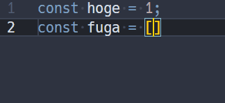

# README

Based on pre-registered rules, automatically fix typo before cursor.

- Default keybinding is <kbd>alt+backspace</kbd> .
- Rule can be configured with `fix-last-typo.pairs` in `settings.json`.
    - Default: `[".,", ":;", "=~", "。、", "。，", "：；"]`

---

**Enjoy!**
